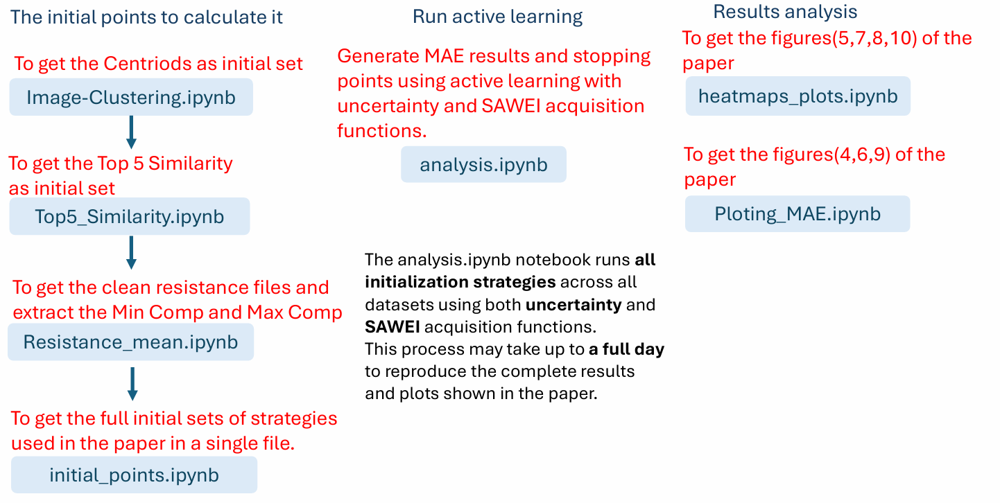

# multimodal_active_learning_ccss
Multi-modal cold start active learning for compositionally complex solid solutions.
This work addresses the cold-start problem in active learning (AL) for experimental materials science by leveraging multimodal priors—numerical (EDX), visual (wafer images), and textual (literature-derived embeddings)—to select diverse, informative initial measurement points. The goal is to train accurate surrogate models (Gaussian Processes) for predicting functional properties (e.g., resistance) with minimal costly measurements.


##### This is a workflow overview for running the code and getting the paper results.


##  Installation

To set up the environment for this project, follow these steps:

### 1. Clone the Repository

```bash
git clone https://github.com/lab-mids/multimodal_active_learning_ccss.git
cd multimodal_active_learning_ccss
```
### 2. Create the Conda Environment
This project uses a Conda environment defined in environment.yml. You can create it using:
```bash
conda env create -f environment.yml
```
### 3. Activate the Environment
```bash
conda activate multimodal_ccss
```
### Environment
 - python=3.11
  - jupyterlab=4.0.9
  - pandas=2.2.1
  - numpy=1.26.4
  - matplotlib=3.8.4
  - seaborn=0.13.2
  - scikit-learn=1.4.2
  - gpy=1.10.0
  - pydoe2=1.3.0
  - scipy=1.13.0
  - opencv=4.8.1
  - pip

## Raw Data Description (under data/)

###  `resistance_raw` 
it is a folder has subfolders for each materials library used in the study and in inside the subfolders are:
#### 1. `Resistance` Data

- **Source**: Experimental electrical resistance measurements.
- **Format**: CSV file

  - Each measurement point (e.g., physical location on a wafer) has 30 repeated resistance measurements for robustness.
  - There are 342 measurement points, resulting in a total of 30 × 342 = 10,260 rows in the raw file.
  - The mean resistance for each measurement point is later computed and used as the prediction target in machine learning using the Resistance_mean.ipynb from the notebook. folder


#### 2. `EDX` Data

- **Source**: Energy Dispersive X-ray Spectroscopy for elemental composition.
- **Format**: CSV file
- **Contents**:
  - Elemental weight percentages (`Ag`, `Cu`, `Pt`, etc.)
  - Mapping to stage coordinates (`x`, `y`) or index

#### 3. `Wafer Photographs`

- **Source**:  images of wafer samples.
- **Format**: `.JPG` images

#### 4. `EDX_Similarity`
- **Source**: The similarity calculated using Matnexus for the composition and the word "resistance" using the Iterative_Corpus_Refinement.ipynb from the folder "matnexus/Example/Iterative_Corpus_Refinement.ipynb"
- **Format**: CSV file
---
Beside the subfolders for each materials library, there are the EDX_min_max_summary, which has the index of the measurement points of the wafer for the maximum and minimum compositions, Top5_Similarity_Summary which has the top 5 similarity indices for each material library; and the centroids_mapped_with_indices, which has the centroids resulting from clustering the photographs of the wafer for each materials library.

## clean Data Description (under data/)
###  `resistance_cleaned_files` folder has all the cleaned resistance files for all the materials libraries. 
- **Format**: CSV file
- **Contents**:
  - Elemental weight percentages (`Ag`, `Cu`, `Pt`, etc.)
  - Wafer grid coordinates (`x`, `y`) and ID
  - Resistance values
###  `init_choices` 
It is a folder that has all the initial selection indices files for all the materials libraries. 
###  `Results` (under data/)
#### Uncertainty/
This folder contains subfolders for each material library dataset used in the uncertainty-based active learning experiments.
Each subfolder includes:

CSV files (*_final_predictions.csv): Final model predictions compared to the ground truth resistance values after completing the active learning loop.

PNG files (*_indexed_predictions_plot.png): Indexed prediction plots visualizing model performance across the wafer surface.

CSV summaries (mae_priors_results.csv, mae_priors_stopping_indices.csv): Record the Mean Absolute Error (MAE) progression over iterations and the stopping point for each strategy.

Pickle file (mae_priors_all_results.pkl): Serialized object containing the complete experiment results, including MAE history, stopping iteration indices, and gradient stability information.

These results reflect the performance of different initialization strategies under the uncertainty sampling acquisition function.
#### Sawei/
This folder contains subfolders for each material library dataset used in the active learning experiments based on the SAWEI (Self-Adjusting Weighted Expected Improvement) acquisition function.
Each subfolder includes:

CSV files (*_final_predictions.csv): Final predicted resistance values compared to the ground truth after completing the active learning loop.

PNG files (*_indexed_predictions_plot.png): Indexed prediction plots visualizing how well the model captures resistance trends across the wafer.

csv summaries (mae_priors_results.csv, mae_priors_stopping_indices.csv): Provide Mean Absolute Error (MAE)  over iterations and indicate the stopping points for each initialization strategy.

Pickle file (mae_priors_all_results.pkl): A serialized collection of full experimental results, including MAE history, stopping iterations, and gradient stabilization points.

#### wafer_output_black/
Contains processed wafer images for each material library. For each wafer:

The background is removed using GrabCut and contour detection.

Contrast and saturation are enhanced at multiple levels.

K-means clustering identifies the top 5 visually distinct regions.

Centroid coordinates of these regions are saved as potential initial measurement points.

Each folder includes cluster visualizations, centroid CSV files, and the cleaned wafer mask.
#### Compare_result/
contains the heatmap visualizations for all acquisition functions, along with summary comparison plot. These results illustrate the effectiveness of each strategy in reducing the number of required measurements and improving prediction accuracy across the wafer surface. The figuures 
#### MAE_PLOT/
This folder has all the mean absolute error plots of the paper figures 6 and 9.

## matnexus/ (under matnexus/Example)
The Example folder contains a notebook (Top5_Similarity.ipynb) that uses text data—such as research abstracts—to identify material compositions most related to a target property (e.g., resistance). It trains a Word2Vec model to compute similarities between property terms and composition descriptors. The most relevant compositions are then selected as informed starting points for cold-start active learning.

## Core Scripts (under scripts/)
### gaussian_process_basic.py 
Implements a simple Gaussian Process model using uncertainty sampling to select new points.
### gaussian_process_sawei.py
Implements the SAWEI model (Self-Adjusting Weighted Expected Improvement), which combines uncertainty and improvement.
### measurement_devices.py
Simulates how resistance measurements are taken on the wafer. It manages feature extraction and returns measured values.
### wafer_circle_clustering.py
This script takes a wafer image, cleans the background, enhances contrast and saturation, and runs K-means clustering to highlight the most distinct regions.
It then extracts the top 5 cluster centers as initial measurement points and saves them for use in the active learning pipeline.
### map_centroids_to_wafer.py
Maps cluster centroids onto a wafer image using stage coordinates from a CSV.
### run_active_learning.py	
This script is the core of the active learning pipeline described in our paper. It runs cold-start active learning experiments across different datasets and initialization strategies, using Gaussian Process models to iteratively select and predict resistance measurements on wafer data.
What’s inside?
loop() – it is the function that trains the model, updates it with new points, and stops when predictions stabilize.

select_initial_indices() – Picks initial points using methods like Random, LHS, K-Means, Farthest, ODAL, and K-Center.

generate_full_merged_strategies() – Combines strategies (e.g., visual + composition) to test if mixing helps.

plot_final_predictions_indexed() – Plots predicted vs. true resistance values for easy comparison.

run_active_learning_experiment() – Ties everything together: loads data, runs all strategies, saves results and plots.


### compare_func_heatmaps.py
This script analyzes and visualizes how much each mixed strategy improves or worsens the stopping iteration compared to its base strategy (e.g., "Top 5 Similarity+Random" vs. "Top 5 Similarity"). Also, the summary of performance across all datasets of reduction, increase or no change once the strategy is paired.
What’s inside?
analyze_stopping_iteration_differences()
Loads results from all folders, compares stopping iterations of base vs. mixed strategies, and saves both

plot_decreased_only_heatmap_sorted()
Creates a heatmap showing which mixed strategies reduced the number of measurements needed (i.e., earlier stopping). Highlights only those that showed a meaningful improvement (e.g., saving over 50%)

plot_heatmap_base_less_than_100()
Focuses on strategies where the base strategy already stopped early (<100 iterations). Highlights only those that showed a meaningful improvement (e.g., saving over 20%)

plot_strategy_comparison_summary()
Combines results from both SAWEI and uncertainty-based acquisition to compare how each base strategy performs across acquisition functions.
The output is a grouped bar chart with detailed change types (increased, decreased, no change) per strategy.

### plotting_MAE.py
This script provides several plotting functions to visualize the performance of active learning strategies across material datasets.

What’s inside?
plot_strategy_across_datasets
Plots a single strategy’s MAE curve across different datasets. It adds a measurement uncertainty line, and colors each dataset distinctly.

plot_all_base_and_mixed_strategies
Plots base strategies (e.g., Random, FPS) and their combinations with a main strategy (e.g., ODAL+Random) in one plot, using solid and dashed lines to distinguish them.

plot_initialization_strategies
Visualizes selected initial points for each strategy on a wafer grid, overlaying resistance values with color and marking chosen indices with red markers.


## Running the Code from the Notebook
### Image-Clustering
This notebook performs clustering on wafer images (e.g. K-means) after preprocessing (contrast/saturation).
It extracts centroids from the clustered regions and maps them back to measurement point indices on the wafer grid using stage coordinates.


### initial_points
This notebook generates initial index JSON files per material library using:

Top-5 similarity indices (Top5_Similarity_Summary)

Max/Min composition points (EDX_min_max_summary)

Cluster centroids from wafer images (centroids_mapped_with_indices)

It also adds computed strategies:

Random, LHS, K-Means, FPS, ODAL, K-Center

All combined and saved to DATA_CLEAN_InIT_CHOICES as <folder>_indices.json.

### analysis 
This notebook runs the active learning for the two acquisition functions using the "run_active_learning.py", 
Uncertainty-based acquisition using a standard GP model (GPBasic) and SAWEI (Similarity-Aware Expected Improvement) acquisition using a similarity-weighted GP model (GPSawei)

```python

run_active_learning_experiment(
    datasets=datasets,
    init_json_dir=DATA_CLEAN_InIT_CHOICES,
    output_base_path=UNCERTAINTY_PATH,
    generate_full_merged_strategies=generate_full_merged_strategies,
    loop_function=loop,
    ResistanceClass=Resistance,
    GPModelClass=GPBasic,  
    plot_final_predictions_indexed_func=plot_final_predictions_indexed
)
```

```python
run_active_learning_experiment(
    datasets=datasets,
    init_json_dir=DATA_CLEAN_InIT_CHOICES,
    output_base_path=SAWEI_PATH,
    generate_full_merged_strategies=generate_full_merged_strategies,
    loop_function=loop,
    ResistanceClass=Resistance,
    GPModelClass=GPSawei,
    plot_final_predictions_indexed_func=plot_final_predictions_indexed
)
```
### Ploting_MAE
It plots the mean absolut error of the paper and the selected initial points (marked with red Xs) overlaid on the wafer grid.

- Visualize initial points selected by different strategies
```python
base_dir = MAE_PLOT
filename = "initialization_strategies_10374.pdf"
save_path = os.path.join(base_dir, filename)

plot_initialization_strategies(csv_path=DATASET_10374_Ir_Pd_Pt_Rh_Ru,
    all_init_strategies=init_choices, output_path=save_path)


```
- Compare MAE of mixed vs. base strategies
```python
base_dir = MAE_PLOT
filename = "Top5Similarity-10311_uncertainty.pdf"
save_path = os.path.join(base_dir, filename)

df = pd.read_csv(MAE_PRIORS_10311)


plot_all_base_and_mixed_strategies(df, main_strategy="Top5Similarity", save_path=save_path ,base_strategies=base_strategies)
```
- Plot MAE curves across datasets for a given strategy
```python
plot_strategy_across_datasets(
    strategy="Centroids_saturation_low",
    dataset_paths=dataset_paths,
    dataset_labels=dataset_labels,
    save_path=save_path,
    measurement_uncertainty=0.005,
)
```
### heatmaps_plots
This notebook calculates and plots all the heatmaps of the paper and the summary of the acquisition functions.
- To analyzes how early different strategies can confidently stop active learning and saves both the summary and visualization.

```python
csv_path = os.path.join(summary_folder_Uncertainty, "strategy_comparison_stopping_summary_uncertainty.csv")
barplot_path = os.path.join(summary_folder_Uncertainty, "strategy_comparison_stopping_summary_uncertainty_plot.png")
heatmap_path = os.path.join(summary_folder_Uncertainty, "uncertainty_heatmap.png")

analyze_stopping_iteration_differences(
    base_dir=UNCERTAINTY_PATH,
    save_csv_path=csv_path,
    save_plot_path=barplot_path
)
```

Heatmap that summarises the number of reduced measurements across all the datasets.

Displays measurement reductions for all main (base) initialization techniques.
.
```python
heatmap_path_base= os.path.join(summary_folder_Uncertainty, "uncertainty_base_heatmap.png")
plot_heatmap_base_less_than_100(df_summary, heatmap_path_base )
```

Displays measurement reductions for all combined initialization techniques.
```python
df_summary = pd.read_csv(csv_path)
plot_decreased_only_heatmap_sorted(df_summary, heatmap_path)
```


